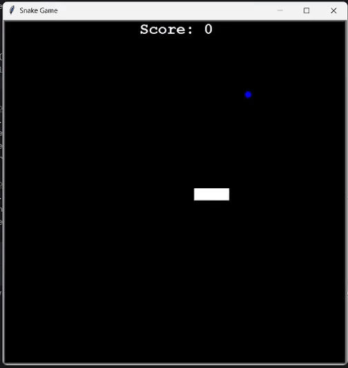

# 🐍 Classic Snake Game (Python Turtle)

Welcome to the nostalgic **Snake Game** — a Python recreation of the legendary game we all loved on old Nokia phones! Built using the `turtle` module, this version keeps it simple, retro, and fun 🎮.

## 🔹 Demo

 


---

## 📦 Features

- 🐍 Smooth snake movement  
- 🍎 Random food generation  
- 🧠 Score tracking  
- 🚫 Game over on collision (with wall or self)  
- ✅ Beginner-friendly code using Python’s built-in `turtle` module  

---

## 🎮 Gameplay Instructions
 - Use Arrow Keys to control the snake:
  ↑ Up
  ↓ Down
  ← Left
  → Right

 - Eat food to grow and increase score
 - Avoid hitting the walls or yourself
 - Game over when you collide with any boundary or your own body

## 🛠️ How to Run

### 🔧 Prerequisites

- Python 3.x installed  
- No external dependencies — just Python’s `turtle` module (built-in)

### ▶️ Run the Game

```bash
git clone https://github.com/jim-ayushi-uw/snake_game.git
cd snake_game
python snake_game.py
